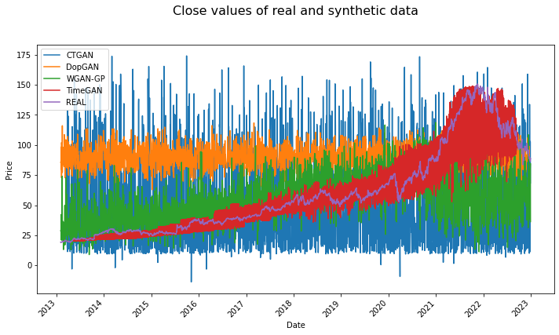
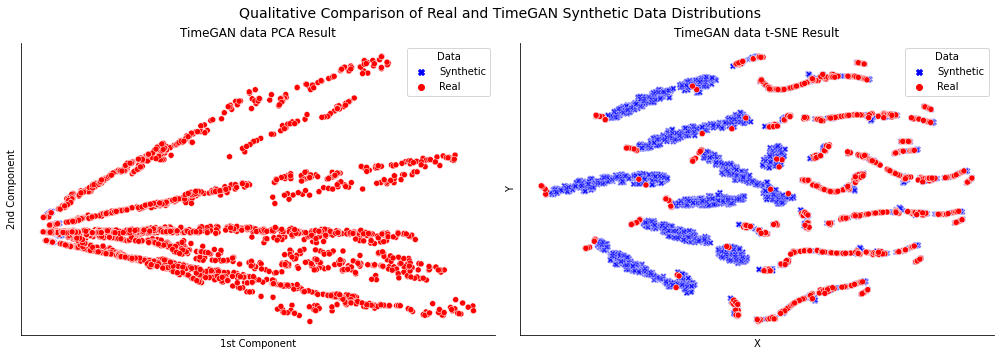
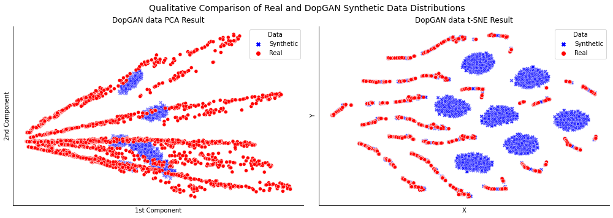

# Prophets of Profit

### Evaluating synthetic-data techniques for financial time-series forecasting

Can GAN-generated synthetic market data train a forecasting model that works on
*real* prices? This project benchmarks four synthetic-data generators
(**WGAN-GP, CTGAN, TimeGAN, DoppelGANger**) by the only test that matters for a
practitioner: train an LSTM on the synthetic data, then measure its forecasting
error on real, unseen prices.



*Ten years of GOOG close prices (REAL, purple) against each generator's synthetic
output. TimeGAN (red) is the only generator to reproduce the underlying trend;
CTGAN (blue) and DoppelGANger (orange) collapse to noise around a mean.*

---

## English

### Why this matters
Financial data is scarce, sensitive, and non-shareable, and history only happens
once. Synthetic data promises a way to augment limited datasets, share data
without leaking real records, and stress-test models. But synthetic data is only
useful if a model trained on it transfers to reality. This project measures that
transfer directly.

### Approach
1. **Data** (`s1`): 10 years (2013-2022) of daily GOOG close prices from Yahoo
   Finance, enriched with peer-company closes and a set of technical indicators
   (SMA, EMA, MACD, RSI, ATR, Bollinger Bands, RSV - see `indicator_generator.py`).
   Weakly-correlated features were dropped via a correlation heatmap, leaving 21
   features.
2. **Baseline** (`s2`): an LSTM forecasting model, hyper-parameters tuned by grid
   search, trained and tested on the real data.
3. **Generators** (`s3`-`s6`): four synthetic datasets produced with WGAN-GP
   (implemented from scratch), CTGAN, TimeGAN and DoppelGANger.
4. **Evaluation** (`s7`): for each generator, train a fresh LSTM on (a) synthetic
   data only and (b) synthetic + real combined, then test on **real** prices.
   Report RMSE, and compare distributions qualitatively with PCA and t-SNE.

### Results
Forecasting RMSE on real, unseen prices (lower is better):

| Generator      | Trained on synthetic only | Trained on synthetic + real |
| -------------- | :-----------------------: | :-------------------------: |
| **TimeGAN**    | **4.18**                  | 11.75                       |
| WGAN-GP        | 22.93                     | 17.82                       |
| DoppelGANger   | 31.99                     | **8.85**                    |
| CTGAN          | 38.78                     | 44.30                       |

**Key findings**
- **TimeGAN wins on standalone utility.** A model trained *only* on TimeGAN
  synthetic data forecasts real prices with the lowest error by a wide margin -
  it is the only generator that captures the temporal trend (see the chart above).
- **DoppelGANger wins as an augmenter.** When mixed with real data, DoppelGANger
  gives the biggest accuracy boost, cutting RMSE to 8.85.
- **CTGAN is the wrong tool.** Designed for tabular data, it ignores temporal
  ordering and performs worst in both settings - a useful negative result.
- **Distributional similarity is not downstream utility.** In t-SNE space
  TimeGAN's synthetic points form their own clusters, distinct from the real data,
  yet still produce the best forecasts. Judging synthetic data by how "real" it
  looks can be misleading; the downstream task is the real test.

| TimeGAN: PCA & t-SNE | DoppelGANger: PCA & t-SNE |
| --- | --- |
|  |  |

### Reproduce it
Run the notebooks in order; each saves the artefacts the next one needs.

```bash
python3 -m pip install -r requirements.txt
jupyter notebook
```

- `s1_Data prep.ipynb` - download data, engineer features, build the dataset
- `s2_LSTM baseline model.ipynb` - tune and train the baseline forecaster
- `s3_WGAN-GP.ipynb` - WGAN-GP synthetic dataset (from-scratch PyTorch)
- `s4_CTGAN.ipynb` - CTGAN synthetic dataset
- `s5_TimeGAN.ipynb` - TimeGAN synthetic dataset
- `s6_DopGAN.ipynb` - DoppelGANger synthetic dataset (trained on Colab)
- `s7_Model_comparision.ipynb` - train/test all models, RMSE table, PCA/t-SNE
- `s8_modern_approaches.ipynb` - 2026 perspective (see below)
- `indicator_generator.py` - technical-indicator helper class used in `s1`

### How I would approach this in 2026
This study was completed in 2024 with the GAN-based methods that were
state-of-the-art at the time. If I revisited it now I would:
- **Use diffusion models for time series** (e.g. score-based / denoising-diffusion
  approaches such as TSDiff and Diffusion-TS), which have largely overtaken GANs
  for time-series generation on both fidelity and stability, and avoid the
  mode-collapse and unstable adversarial training seen here.
- **Add a proper quantitative fidelity suite** rather than relying on PCA/t-SNE by
  eye: discriminative and predictive scores (the TimeGAN protocol), plus
  distributional distances.
- **Swap the LSTM baseline** for a modern time-series forecaster (e.g. a patch-based
  transformer like PatchTST, or N-BEATS/N-HiTS) as the downstream model.

A short notebook, `s8_modern_approaches.ipynb`, expands on this with a concrete
plan and references. It is an *addendum* - the original 2024 study is unchanged.

### Tech stack
Python, TensorFlow/Keras (LSTM), PyTorch (WGAN-GP), CTGAN, TimeGAN, DoppelGANger,
scikit-learn (PCA/t-SNE), pandas, yfinance, matplotlib/seaborn.

---

## Français

### Pourquoi c'est important
Les données financières sont rares, sensibles et non partageables, et l'histoire
ne se produit qu'une fois. Les données synthétiques promettent d'augmenter des
jeux de données limités, de partager sans divulguer de vraies données et de
tester les modèles. Mais elles ne sont utiles que si un modèle entraîné dessus
fonctionne sur des données réelles. Ce projet mesure ce transfert directement.

### Démarche
1. **Données** (`s1`) : 10 ans (2013-2022) de cours de clôture GOOG (Yahoo
   Finance), enrichis de cours d'entreprises comparables et d'indicateurs
   techniques (SMA, EMA, MACD, RSI, ATR, Bandes de Bollinger, RSV). 21 variables
   retenues après analyse de corrélation.
2. **Référence** (`s2`) : un modèle LSTM de prévision, hyper-paramètres optimisés
   par grid search, entraîné et testé sur données réelles.
3. **Générateurs** (`s3`-`s6`) : quatre jeux synthétiques (WGAN-GP, CTGAN,
   TimeGAN, DoppelGANger).
4. **Évaluation** (`s7`) : pour chaque générateur, entraîner un LSTM sur (a) le
   synthétique seul et (b) synthétique + réel, puis tester sur le **réel**. RMSE
   et comparaison qualitative par PCA et t-SNE.

### Résultats
RMSE de prévision sur des prix réels jamais vus (plus bas = meilleur) :

| Générateur     | Entraîné sur synthétique seul | Synthétique + réel |
| -------------- | :---------------------------: | :----------------: |
| **TimeGAN**    | **4.18**                      | 11.75              |
| WGAN-GP        | 22.93                         | 17.82              |
| DoppelGANger   | 31.99                         | **8.85**           |
| CTGAN          | 38.78                         | 44.30              |

**Conclusions clés**
- **TimeGAN** est le meilleur en utilisation autonome : c'est le seul générateur
  qui capture la tendance temporelle.
- **DoppelGANger** est le meilleur en augmentation (mélangé au réel).
- **CTGAN**, conçu pour le tabulaire, ignore l'ordre temporel et échoue dans les
  deux cas (résultat négatif utile).
- **La ressemblance distributionnelle n'est pas l'utilité réelle** : en t-SNE,
  TimeGAN forme ses propres clusters distincts du réel mais produit les meilleures
  prévisions. Juger des données synthétiques sur leur seul aspect "réaliste" peut
  induire en erreur.

### Reproduire
Exécuter les notebooks dans l'ordre (`s1` à `s7`) :
```bash
python3 -m pip install -r requirements.txt
jupyter notebook
```
Voir la section anglaise pour le détail de chaque notebook et la stack technique.

### Ce que je ferais en 2026
Étude réalisée en 2024 avec les méthodes GAN alors état de l'art. Aujourd'hui je
privilégierais les **modèles de diffusion pour séries temporelles** (TSDiff,
Diffusion-TS), une **suite de métriques de fidélité quantitatives** (scores
discriminatif et prédictif) et un **modèle de prévision moderne** (PatchTST,
N-HiTS) en aval. Détails dans `s8_modern_approaches.ipynb` (addendum ; l'étude
de 2024 reste inchangée).

## License
[MIT](LICENSE)
